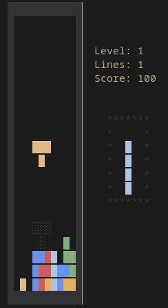

# Ketris - A Tetris Clone in JVM Kotlin

This is a simple project to recreate Tetris with [Kotlin](https://kotlinlang.org) on the JVM, using terminal visualization via [Lanterna](https://github.com/mabe02/lanterna).

## Running the Game

* When running from a terminal (such as via `java -jar ketris.jar`), the game should favor rendering in the TTY of the terminal if available.
* When running from within an IDE or GUI environment, simply running the `Ketris.kt` file should start the game. Ketris (via Lanterna) should choose to emulate via Swing
whenever a terminal is not available.

## Building Ketris

The `ketris.jar` is generated simply by running `./gradlew shadowJar`, and can be found in `build/libs`.

## Project Structure

This project is pretty simple overall, consisting of:

* `Ketris` - This is home to the main function, which establishes global state for the game, such as the screen, input, game, and graphics,
  and also bootstraps the core game loop.
* `Clock` - The clock helps with managing the game tick based on common tetris game rules, and feedback from the game logic
* `Shapes` - The shapes enumeration defines the common "tetrominoes" for Tetris, including their default coordinates and shape
* `Input` - The input class translates command-line input into a logical input state that can be processed per-loop
* `Graphics` - This class understands how to map the current game state into Lanterna rendering commands
* `Game` - The high-level Tetris game logic exists in this class, including calculation of scores and game speed (gravity) based on lines collapsed
* `Board` - The board is managed by the `Game`, and contains current piece and "cell" state for the game, and calculates matches and line scores